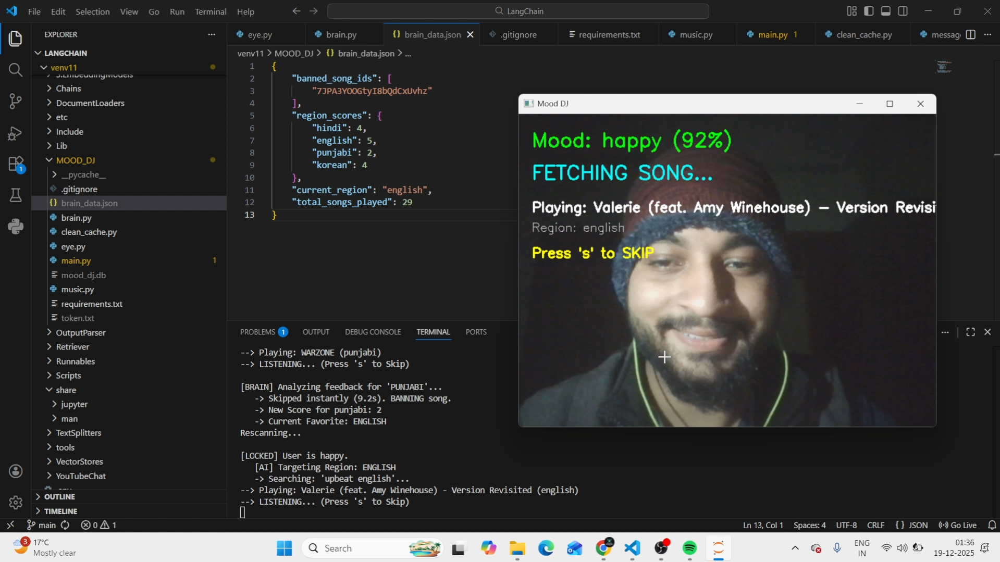
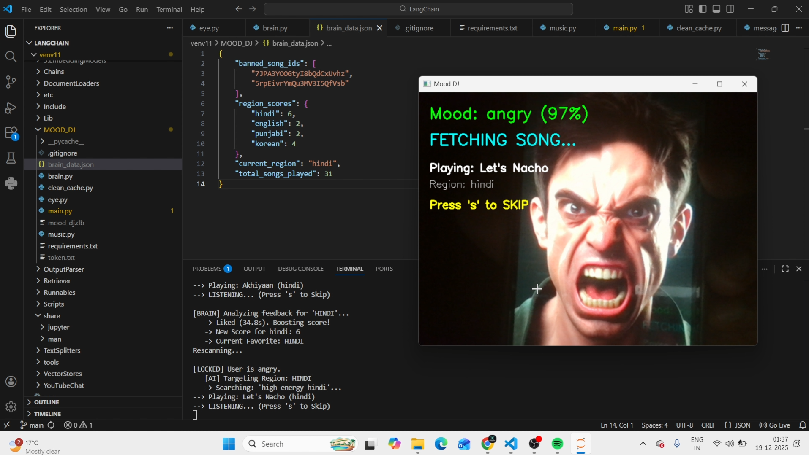

<div align="center">

# 🎧 Mood DJ
### The AI That Spins Tracks Based on Your Tracks.

[](https://www.python.org/)
[](https://developer.spotify.com/)
[]()

<br>

Start the app. Look at the camera. Let the music play.

📺 ➜ 🧠 ➜ 🎵
<br>
<b>Detect. Analyze. Vibe.</b>

</div>

---

## 📸 Demo

Here is Mood DJ in action. It detects the user is "Happy" and queues upbeat Pop music instantly.





## 🔮 The Vibe Flow

This isn't just a shuffle button. It's an intelligent loop that connects your biology to Spotify's library.

```mermaid
%%{init: {'theme': 'base', 'themeVariables': { 'primaryColor': '#191414', 'primaryTextColor': '#1DB954', 'primaryBorderColor': '#1DB954', 'lineColor': '#1DB954', 'secondaryColor': '#191414', 'tertiaryColor': '#282828'}}}%%
graph LR
    subgraph INPUT
    A[📹 Webcam Feed] -->|Captures| B(👁️ OpenCV Vision);
    end
    
    B -->|Extracts Face Data| C{🧠 The BRAIN Engine};
    
    subgraph DECISION CORE
    C -- "Happy 😊" --> D[🎹 Upbeat / Pop];
    C -- "Sad 😢" --> E[🎻 Acoustic / Lo-Fi];
    C -- "Angry 😠" --> F[🎸 Rock / Metal];
    C -- "Neutral 😐" --> G[🎷 Chill / Jazz];
    end

    D --> H[⚡ Spotipy Connect];
    E --> H;
    F --> H;
    G --> H;
    
    subgraph OUTPUT
    H -->|API Command| I((🔊 LIVE PLAYBACK));
    end

    style I fill:#1DB954,stroke:#FFFFFF,stroke-width:2px,color:white
